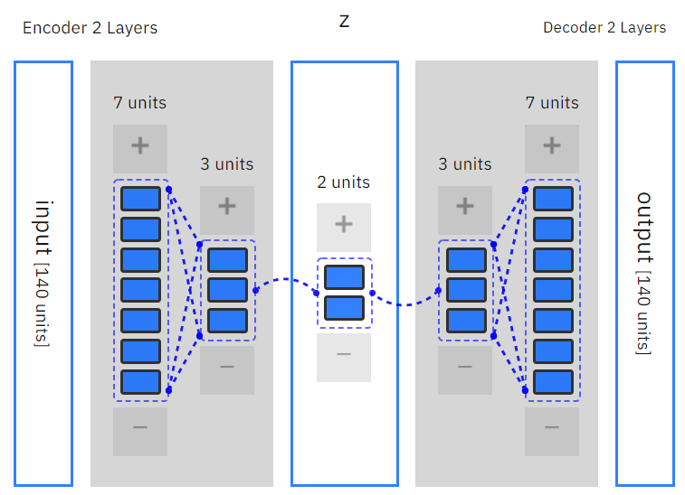

Anomagram is an interactive visualization tool for exploring how a deep learning model can be applied to the task of anomaly detection (on stationary data).

Given an ECG signal sample, an autoencoder model (running live in your browser) can predict if it is normal or abnormal. 
 
To try it out, click any of the test ECG signals from the ECG5000 dataset below, or better still, draw a signal to see the model's prediction!

[Link](https://anomagram.fastforwardlabs.com/#/)

