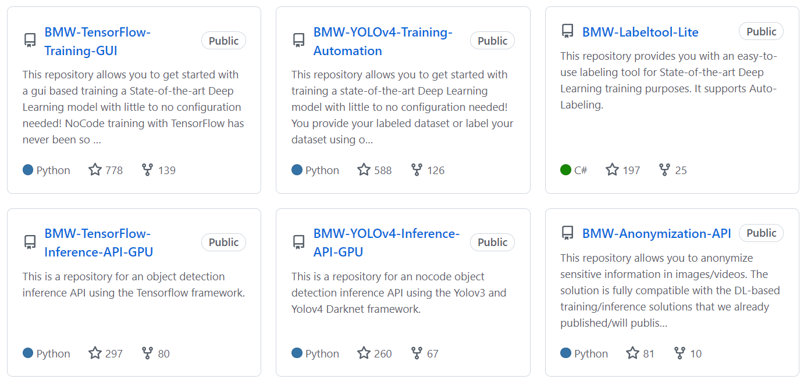

This organization contains software for realtime computer vision published by the members, partners and friends of the BMW TechOffice MUNICH and InnovationLab.

[Link](https://github.com/BMW-InnovationLab)