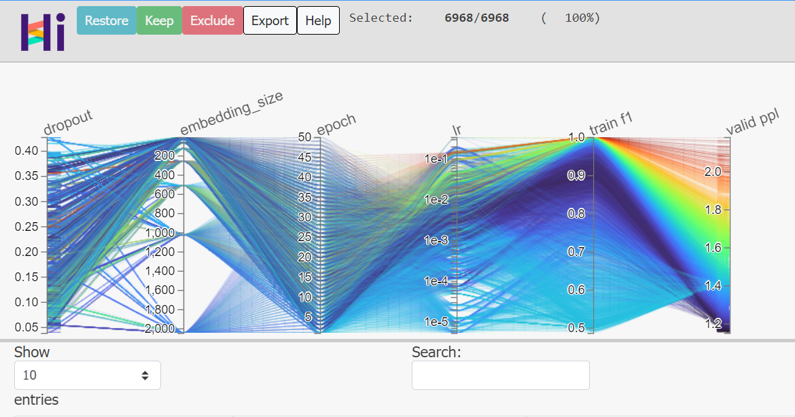

Given about 7000 experimental datapoints, we want to understand which parameters influence the metric we want to optimize: valid ppl. How can HiPlot help?

* On the parallel plot, each line represents one datapoint. Slicing on the valid ppl axis reveals that higher values for lr lead to better models.

* We will focus on higher values for the lr then. Un-slice the valid ppl axis by clicking on the axis, but outside of the current slice. Slice on the lr axis values above 1e-2, then click the Keep button.

* Let’s see now how the training goes by adding a line plot. Right click the epoch axis title and select Set as X axis. Similarly, set valid ppl as the Y axis. Once you have done both, an XY line plot should appear below the parallel plot.

* Slicing through the dropout, embedding_size and lr axis reveals how they can affect the training dynamics: convergence speed and maximum performance.

[Link](https://facebookresearch.github.io/hiplot/)