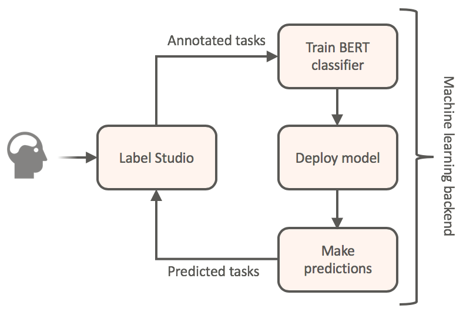

Slack chats can become messy with time, proving difficult to extract meaningful information. 

In this article, I want to present a quick codeless way of fine-tuning and deploying the commonly used BERT classifier to do conversational analysis. 

We will use that system to extract tasks, facts, and other valuable information from our Slack conversations. 

It could be easily extended for categorizing any other textual data, like support requests, emails, etc.

[Link](https://towardsdatascience.com/how-to-finetune-bert-to-classify-your-slack-chats-without-coding-3a7002936bcf)