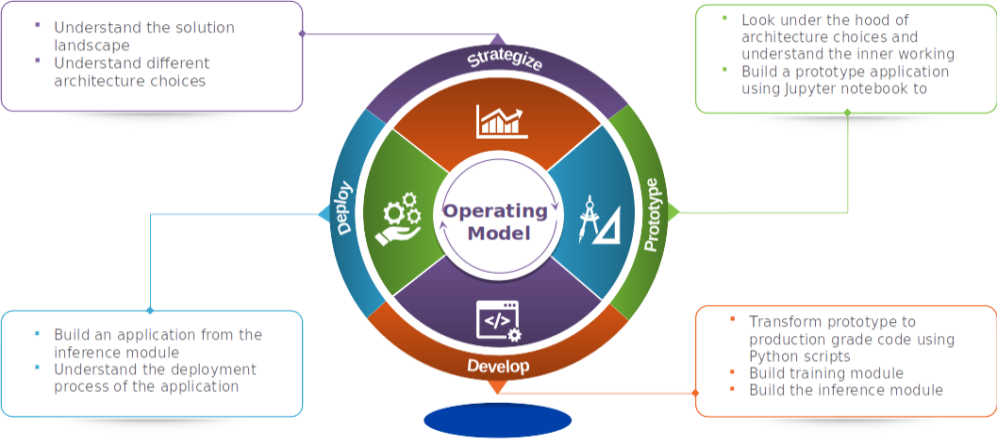

### Build and Deploy Data Science Products : A Practical Guide to Building a Machine Translation Application

This journey is going to be a 8 steps.
 
In this series we will take a use case, understand the solution landscape and its evolution, 
explore different architecture choices, look under the hood of the architecture to understand the nuts and bolts, 
build a prototype, convert the prototype into production ready code, build an application from the production ready code 
and finally understand the process for deploying the application .

1. [Understand the landscape of solutions available for machine translation](https://bayesianquest.com/2020/10/24/build-your-machine-translation-application-byte-by-byte/)

2. [Explore sequence to sequence model architecture for machine translation](https://bayesianquest.com/2020/10/24/ii-build-and-deploy-data-science-products-exploring-sequence-to-sequence-architecture-for-machine-translation/)

3. [Deep dive into the LSTM model with worked out numerical example](https://bayesianquest.com/2020/10/24/iii-build-and-deploy-data-science-products-looking-under-the-hood-of-machine-translation-model-lstm-forward-propagation/)

4. [Understand the back propagation algorithm for a LSTM model worked out with a numerical example](https://bayesianquest.com/2020/10/24/iv-build-and-deploy-data-science-products-looking-under-the-hood-of-machine-translation-model-lstm-backpropagation/)

5. [Build a prototype of the machine translation model using a Google colab / Jupyter notebook](https://bayesianquest.com/2020/10/24/v-build-and-deploy-data-science-products-machine-translation-application-develop-the-prototype/)

6. [Build the production grade code for the training module using Python scripts](https://bayesianquest.com/2020/10/24/vi-build-and-deploy-data-science-products-machine-translation-application-from-prototype-to-production-introduction-to-the-factory-model/)

7. [Building the Machine Translation application -From Prototype to Production : Inference process](https://bayesianquest.com/2020/10/24/vii-build-and-deploy-data-science-products-machine-translation-application-from-prototype-to-production-for-inference-process/)

8. [Build the machine translation application using Flask and understand the process to deploy the application on Heroku](https://bayesianquest.com/2020/10/24/viii-build-and-deploy-data-science-products-machine-translation-application-build-and-deploy-using-flask/)

