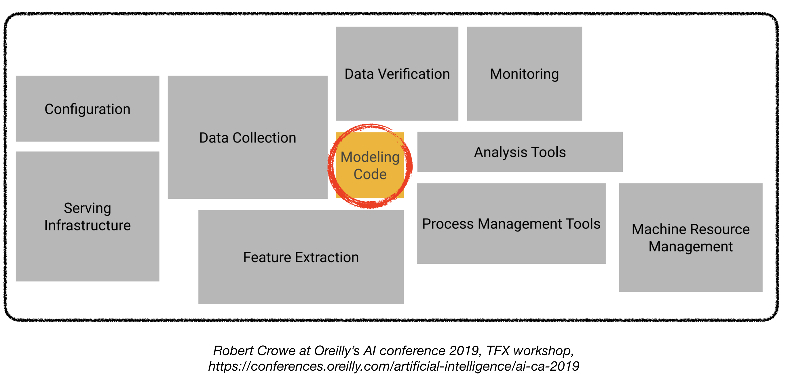

Deploying deep learning models in production can be challenging, as it is far beyond training models with good performance. 

Several distinct components need to be designed and developed in order to deploy a production level deep learning system (seen below):

[Link](https://github.com/alirezadir/Production-Level-Deep-Learning)

